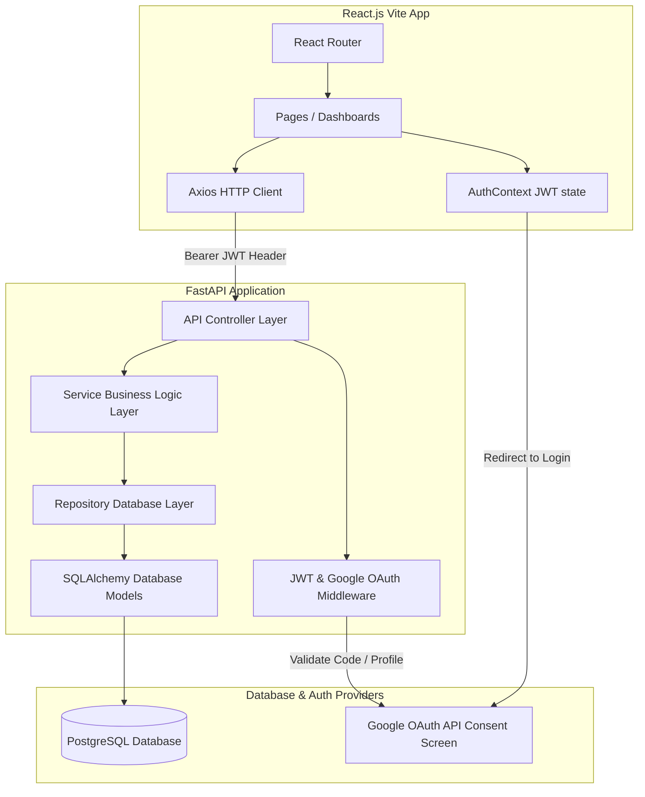

# Architecture Diagram

The system follows a standard three-tier architecture with clean separation of concerns and Google OAuth 2.0-only authentication flow.

### Flow Walkthrough
1. **Unauthenticated User**: Navigates to `/login` on Frontend.
2. **Google Sign-In Triggered**: User clicks "Sign in with Google", browser redirects to `google` consent screen via backend-provided URL.
3. **Authorization Code Flow**: After successful Google Sign-In, user is redirected back to Backend callback endpoint.
4. **Token Exchange**: Backend validates authorization code, exchanges it with Google APIs, gets profile details, registers/updates the user, creates a secure custom JWT, and redirects user to Frontend with the session token.
5. **App Access**: React app stores the JWT token in `localStorage`, and subsequent API calls add it to Axios `Authorization: Bearer <token>` request header, granting access to restricted endpoints based on user roles (`Requester` or `Reviewer`).
