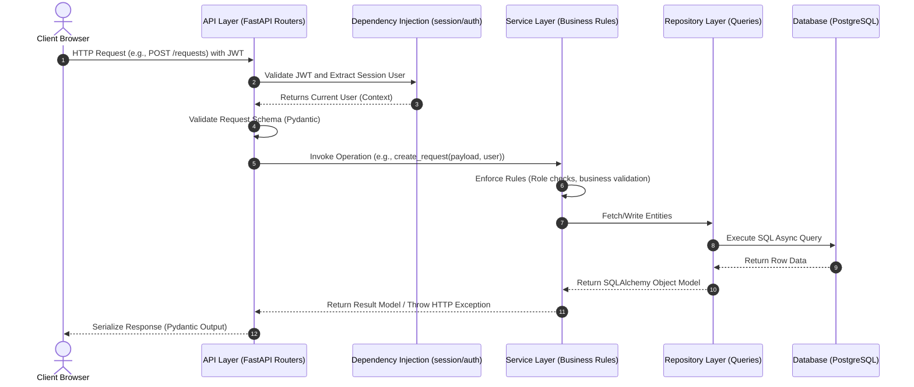

# API Flow Diagram

The backend follows Clean Architecture where requests traverse downwards from the API controller, through services and repositories, to the database.

## Layers Breakdown

1. **Client Browser**: Makes asynchronous Axios requests, attaching the JWT bearer token to header requests.
2. **API Layer**: Exposes routes, defines dependencies, parses JSON, and catches HTTP/Validation errors.
3. **Dependency Injection**: Resolves DB session contexts and extracts/verifies user authorization roles.
4. **Service Layer**: Evaluates business constraints (e.g., "Only owners can modify a PENDING request").
5. **Repository Layer**: Encapsulates raw database queries behind simple clean APIs.
6. **Database**: PostgreSQL processing data transactions.
