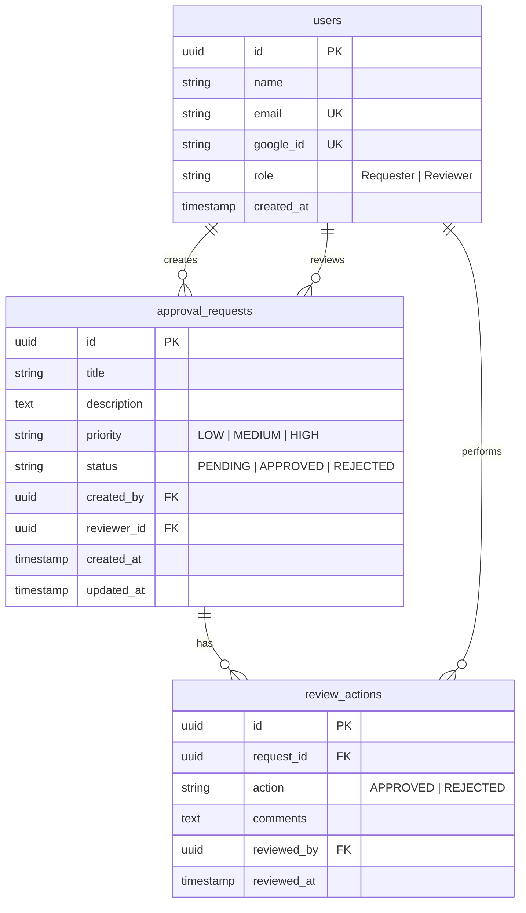

# Database ER Diagram

The database uses PostgreSQL with the following relations:

## Description of Entities

### 1. `users`
- Stores user profiles populated from Google accounts upon first successful login.
- **`role`**: Enforces system permissions. A user is designated either as a `Requester` (can manage own requests) or a `Reviewer` (can approve/reject assigned requests).

### 2. `approval_requests`
- Core entity tracking request details, urgency (`priority`), and current state (`status`).
- **`created_by`**: Foreign key pointing to the user who created it (must be a `Requester`).
- **`reviewer_id`**: Foreign key pointing to the assigned user responsible for reviews (must be a `Reviewer`).

### 3. `review_actions`
- Audit trail logging historical reviewer responses.
- Every review decision creates a corresponding record here capturing action types and comments.
