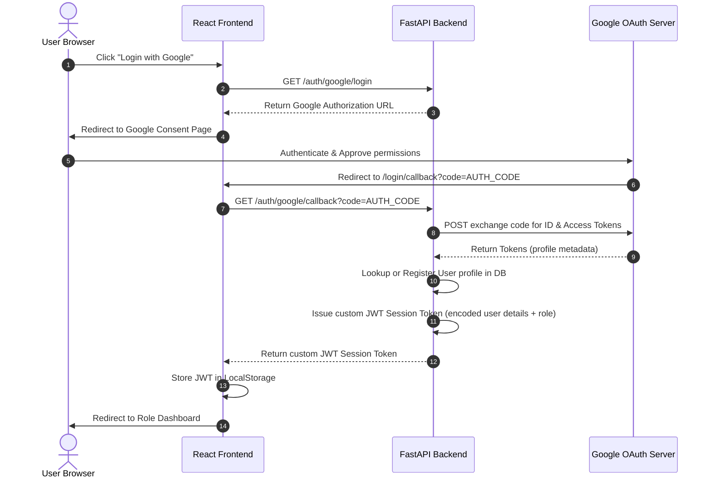

# Google OAuth 2.0 Authentication Flow

This diagram illustrates the step-by-step token exchange flow for Google OAuth 2.0 and custom JWT session management.

## Security Considerations

- **Authorization Code Flow with Server-Side Exchange**: Prevents exposing the Google Client Secret to the frontend client application.
- **Stateless Session Tokens**: Custom JWT tokens contain role mapping values which are signed using the backend's `JWT_SECRET` key to block client manipulation.
