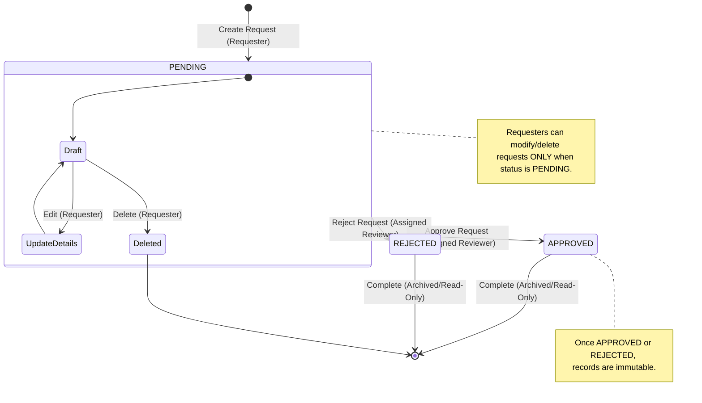

# Request Lifecycle Diagram

This diagram displays the transitions and states of an approval request, including role restrictions.

## State Definitions

1. **PENDING**:
   - Initial state when a requester submits details.
   - Requesters can edit details (title, description, priority, reviewer) or delete the request entirely.
   - Reviewers can view the request in their queue and approve/reject it.
2. **APPROVED**:
   - Final state. The request has been signed off. It is locked and can no longer be edited or deleted.
3. **REJECTED**:
   - Final state. The request has been turned down. It is locked and can no longer be edited or deleted.
4. **Deleted**:
   - The request is completely removed from active tracking.
