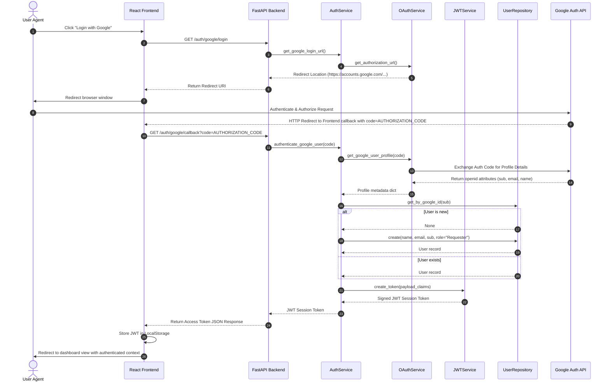

# Google OAuth 2.0 Sequence Diagram

This sequence diagram outlines the interaction flow during the authentication lifecycle:

## Description of Responsibilities

1. **`OAuthService`**: Handles low-level outbound network HTTP requests to Google APIs (redirect location generation, exchanging codes, and fetching user profiles).
2. **`UserRepository`**: Manages queries and persistence operations for User models in the PostgreSQL database.
3. **`JWTService`**: Handles encoding, signing, and verification operations for secure JSON Web Tokens.
